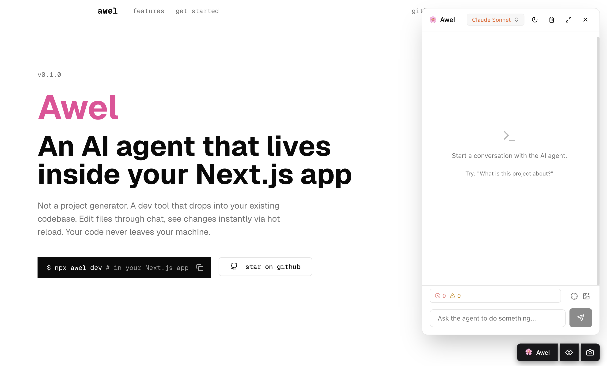
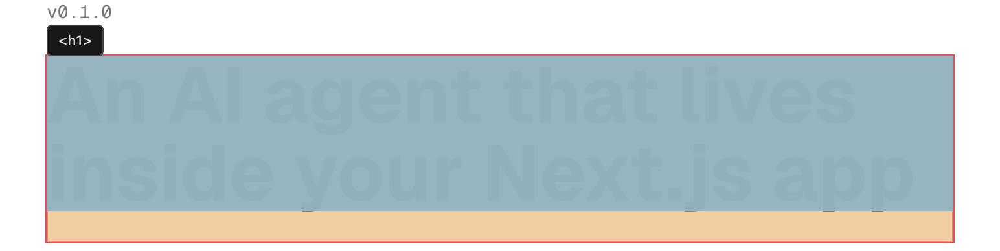
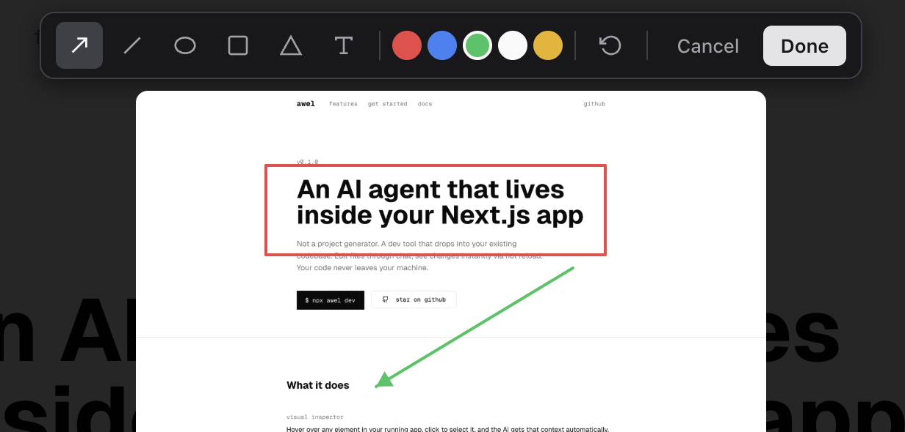

# Awel

English | [中文](./README.zh-CN.md)

AI-powered development overlay for Next.js. Awel runs a proxy in front of your dev server, injects a floating chat button into your app, and lets you talk to an AI agent that can read, write, and edit files in your project — all from an embedded dashboard.



## Quick Start

### Create a new project

```bash
# Set up at least one AI provider (pick one):
export ANTHROPIC_API_KEY="sk-ant-..."   # Anthropic API
export OPENAI_API_KEY="sk-..."          # OpenAI
export GOOGLE_GENERATIVE_AI_API_KEY="..." # Google AI
# Or install the Claude CLI: https://docs.anthropic.com/en/docs/claude-code

npx awel create
```

This scaffolds a new Next.js project and marks it for creation mode. Follow the instructions to `cd` into the project and run `npx awel dev`. You'll see a full-page creation UI where you describe what you want to build — the AI agent generates the entire app for you, then transitions to the normal Awel overlay.

### Use with an existing project

```bash
cd my-existing-next-app
npx awel dev
```

Awel needs at least one configured provider to function. See [Supported Models](#supported-models) for the full list.

This starts Awel on port 3001 and proxies your Next.js dev server on port 3000. Open `http://localhost:3001` to see your app with the Awel overlay.

### Commands

```
awel create              Create a new Next.js project with Awel
awel dev [options]       Start the development server with Awel overlay

  -p, --port <port>    Target app port (default: 3000)
  -v, --verbose        Print LLM stream events to stderr
```

## How It Works

Awel sits between your browser and your dev server:

```
Browser → Awel (proxy on :3001) → Your app (dev server on :3000)
```

1. Awel intercepts HTML responses and injects a small script into the page
2. The script renders a floating button (bottom-right corner, isolated via Shadow DOM)
3. Clicking it opens a full-screen chat dashboard in an iframe
4. You describe what you want — the AI agent reads your code, makes edits, runs commands, and streams results back in real-time

HMR/WebSocket traffic is proxied through transparently and paused during agent file edits to prevent reload interference.

## Supported Models

Awel uses the [Vercel AI SDK](https://sdk.vercel.ai) and supports multiple providers. Set the corresponding environment variable to enable a provider:

| Provider | Env Var | Example Models |
|----------|---------|----------------|
| Claude Code | Claude CLI in PATH | sonnet, opus, haiku |
| Anthropic API | `ANTHROPIC_API_KEY` | claude-sonnet-4-5, claude-opus-4-5 |
| OpenAI | `OPENAI_API_KEY` | gpt-5.2-codex, gpt-5.1-codex |
| Google AI | `GOOGLE_GENERATIVE_AI_API_KEY` | gemini-3-pro-preview, gemini-2.5-pro |
| Qwen | `DASHSCOPE_API_KEY` | qwen-max, qwen-plus-latest |
| MiniMax | `MINIMAX_API_KEY` | MiniMax-M2 |
| Vercel Gateway | `AI_GATEWAY_API_KEY` | Various models via gateway |

Switch models at any time from the dropdown in the dashboard header.

## Agent Tools

The AI agent has access to:

- **Read** / **Write** / **Edit** / **MultiEdit** — file operations
- **Bash** — run shell commands
- **Glob** / **Grep** / **CodeSearch** — find files and search code
- **WebSearch** / **WebFetch** — look things up on the web
- **ProposePlan** — propose a multi-step plan for your approval before executing
- **AskUser** — ask you clarifying questions mid-stream
- **RestartDevServer** — restart your dev server after config changes
- **TodoRead** / **TodoWrite** — track tasks across the conversation

## Features

- **Element inspector** — click the crosshair icon to select an element in your app and attach it as context to your prompt

  

- **Screenshot annotator** — annotate screenshots with shapes, arrows, and text before sending to the agent

  

- **Image attachments** — attach screenshots or reference images
- **Plan approval** — the agent can propose plans for you to review before making changes
- **Undo** — roll back all file changes from an agent session in one click
- **Diff review** — review a summary of all file changes before accepting
- **Dark mode** — follows your system preference
- **i18n** — English and Chinese
- **Creation mode** — `awel create` scaffolds a new project and launches a full-page AI chat where you describe your app and the agent builds it from scratch

## Development

```bash
npm run build           # Build everything
npm run dev             # Watch mode (CLI only)
```

Individual builds:

```bash
npm run build:cli       # TypeScript → dist/cli/
npm run build:dashboard # Vite → dist/dashboard/
npm run build:host      # esbuild → dist/host/host.js
```

## License

MIT
